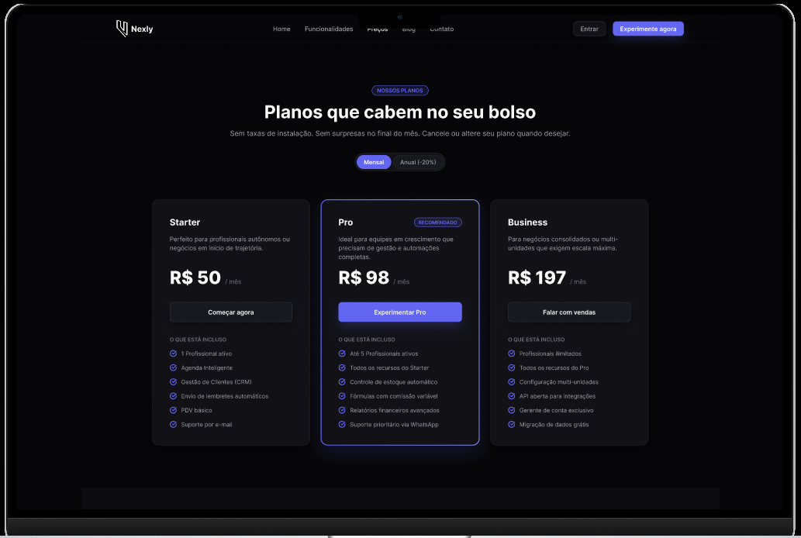
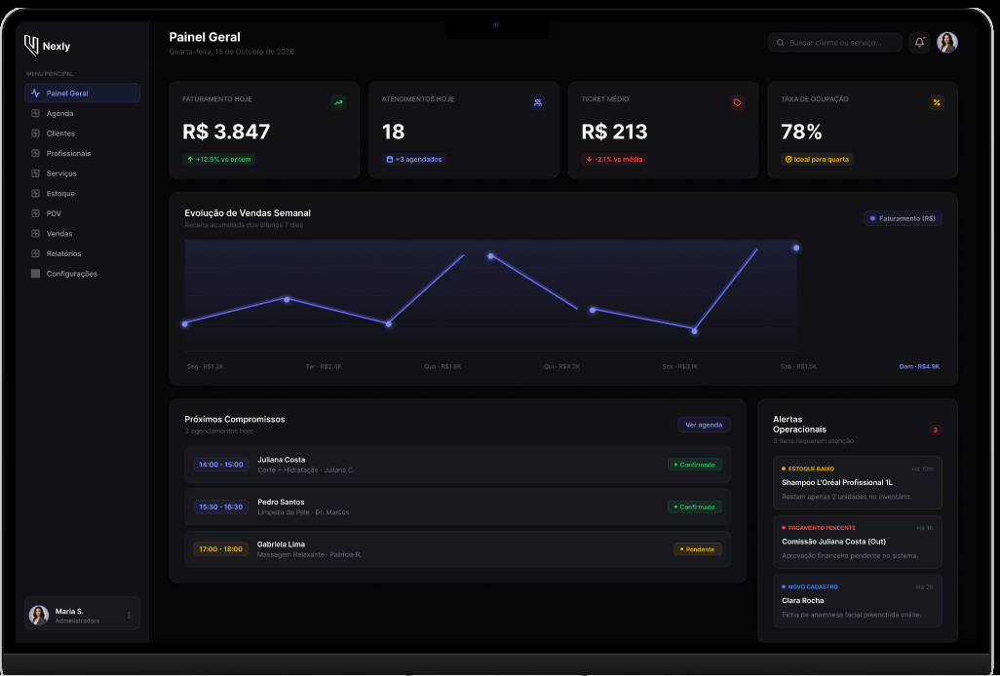

# Nexly — Gestão para pequenos negócios

<p align="center">
  
  
  
  
  
  
  
  
  <br>
  
  
  
  
</p>

---

## O que é o Nexly?

O **Nexly** é uma plataforma SaaS de **gestão para pequenos negócios** (salões, clínicas, petshops, estúdios)
que hoje dependem de planilhas, cadernos ou apps separados para organizar **agenda** e **estoque**.

O sistema une, em um único login **multi-empresa**, dois módulos essenciais:

- 📅 **Agenda de horários e serviços** — clientes, profissionais, serviços e agendamentos com controle de status.
- 📦 **Estoque e PDV** — produtos, movimentações, vendas no balcão e alertas de estoque.

O diferencial central do Nexly está na **integração entre os dois módulos**: ao concluir um serviço agendado,
os **insumos configurados são baixados automaticamente do estoque** — eliminando o retrabalho manual e
recuperando a lucratividade perdida pela falta de visibilidade do custo real de cada atendimento.

Projeto desenvolvido como **Trabalho de Conclusão de Curso (TCC)** do técnico em
**Desenvolvimento de Sistemas · SENAI**, com arquitetura de SaaS multi-tenant real.

---

## O que ele entrega?

### Para o usuário final

- **Dashboard** com receita do mês, ticket médio, horários de pico e alertas de estoque
- **Agenda completa** com validação de conflito de horário e ações rápidas (confirmar, concluir, cancelar)
- **CRUD de Clientes, Profissionais, Serviços e Produtos** com busca, edição inline e máscara de CNPJ/telefone
- **Configuração de insumos por serviço** (qual produto é consumido e em qual quantidade)
- **Controle de estoque** com badges de status (OK / baixo / zerado) e entrada manual
- **PDV** com busca de produto por nome/SKU e finalização rápida da venda
- **Histórico de vendas** com filtro por período e detalhes expandíveis dos itens
- **⭐ Baixa automática de estoque** ao concluir um atendimento
- **Relatórios** de insumo consumido por serviço e horários de pico

### Para o desenvolvedor

- **Monorepo Turborepo** com 2 apps + 2 packages compartilhados
- **Multi-tenancy real** com RLS (Row-Level Security) no PostgreSQL + Prisma Extension
- **Autenticação JWT RS256** com rotação de refresh token e detecção de reuso
- **Event-driven** com EventEmitter2 (o coração da baixa automática de estoque)
- **Cache de dashboard** com Redis
- **Testes unitários** com Jest
- **Swagger** para testar a API diretamente no navegador

---

## Arquitetura

```
┌─────────────────────────────────────────────────┐
│               Frontend (Next.js 14)              │
│            http://localhost:3000                 │
│      React 18 + Tailwind CSS + Recharts          │
└──────────────────┬──────────────────────────────┘
                   │ REST API (JWT Bearer)
┌──────────────────▼──────────────────────────────┐
│               Backend (NestJS)                   │
│            http://localhost:3001                 │
│  Auth │ Usuários │ Clientes │ Agenda │ Estoque   │
│  PDV │ Integração │ Dashboard │ Relatórios       │
└────────┬─────────────────┬──────────────────────┘
         │                 │
┌────────▼─────────┐  ┌────▼────────────┐
│   PostgreSQL     │  │     Redis       │
│   (RLS multi-    │  │  (cache 5 min)  │
│    tenant)       │  └─────────────────┘
└──────────────────┘
```

**Isolamento de dados em duas camadas:**

1. **RLS no PostgreSQL** — mesmo que o código esqueça de filtrar por `empresa_id`, o banco bloqueia o acesso.
2. **Prisma Extension** — injeta o `empresaId` automaticamente em todas as queries dos modelos de negócio.

Para um mergulho profundo (fluxo de baixa automática event-driven, JWT + refresh rotation, decisões arquiteturais), veja o **[ARCHITECTURE.md](ARCHITECTURE.md)**.

---

## 🎨 Design & Protótipo

Antes de partir para a implementação, desenvolvemos o **protótipo visual do Nexly no Figma**, estruturando a experiência do produto e definindo sua identidade visual.

Nesta etapa, trabalhamos em conjunto **Breno J. Oliveira, Felipe Bertaco e Gustavo Barreto**, transformando a proposta do Nexly em um fluxo de produto completo.

O protótipo contempla:

- 🔐 **Login e cadastro**
- 🏢 **Configuração inicial da empresa**
- 🧩 **Personalização e seleção de módulos**
- 💳 **Planos e período de teste**
- 📋 **Termos de Uso**
- 📊 **Dashboard e navegação da plataforma**
- ⚙️ **Configurações e gerenciamento**
- 🎨 **Sistema visual, componentes e estados de interface**
- 📱 **Experiência responsiva e organização dos fluxos**

O principal conceito visual trabalhado foi o de um **Nexly modular**, permitindo que cada empresa monte sua experiência de acordo com suas necessidades.

### 🔗 Figma

**[Acessar o protótipo completo no Figma](https://www.figma.com/design/nZXYARpSTmoeK3Gg7P0apb/Nexly?node-id=0-1&t=MS9eze0C2z5yJnzS-1)**

### 🎥 Apresentação do protótipo

<p align="center">
  <video src="./capturas/video_figma.mp4" controls width="900"></video>
</p>

### 🖼️ Telas do projeto

<table>
  <tr>
    <td width="50%">
      
    </td>
    <td width="50%">
      
    </td>
  </tr>
  <tr>
    <td width="50%">
      
    </td>
    <td width="50%">
      
    </td>
  </tr>
</table>

---

## Guia de instalação

### 1. Pré-requisitos

- Node.js ≥ 20
- Docker + Docker Compose
- OpenSSL (para gerar as chaves JWT)

### 2. Instale as dependências

```bash
npm install
```

### 3. Suba o banco de dados e o Redis

```bash
docker compose up -d postgres redis
```

### 4. Configure as variáveis de ambiente

```bash
cp .env.example .env
cd apps/api && cp .env.example .env && cd ../..
cd apps/web && cp .env.example .env && cd ../..
```

> O arquivo `.env` nunca deve ser commitado — apenas o `.env.example` (sem valores reais).

### 5. Gere as chaves JWT (RS256)

```bash
openssl genpkey -algorithm RSA -out private.pem -pkeyopt rsa_keygen_bits:2048
openssl rsa -pubout -in private.pem -out public.pem
```

Copie o conteúdo de `private.pem` para `JWT_PRIVATE_KEY` e `public.pem` para `JWT_PUBLIC_KEY` no `apps/api/.env`.
Em desenvolvimento, se as chaves não forem fornecidas, o backend gera um par descartável automaticamente.

### 6. Rode as migrations e o seed

```bash
npm run db:migrate --workspace @nexly/api
npm run db:seed --workspace @nexly/api
```

> Após a primeira migration, aplique o RLS: `npm run rls:apply --workspace @nexly/api`
> (ou execute o arquivo `apps/api/prisma/seed-rls.sql` no banco).

### 7. Rode o projeto

```bash
npm run dev
```

- **Frontend:** http://localhost:3000
- **Backend API:** http://localhost:3001
- **Swagger:** http://localhost:3001/api/docs

### 8. Conta demo (após o seed)

- **E-mail:** `admin@nexly.com.br`
- **Senha:** `nexly123`

O seed cria uma empresa `Salão Beleza Total` com 3 profissionais, 6 produtos (2 com alerta de estoque),
6 serviços (4 com insumos configurados), 5 clientes, 30 agendamentos passados + 3 hoje + 7 futuros
e 20 vendas no PDV — dados suficientes para explorar o dashboard e o histórico.

---

## Como rodar os testes

```bash
# Typecheck (API + Web)
npm run typecheck

# Testes unitários da API (Jest — 15 suites / 93 testes passando)
cd apps/api && npm test
```

---

## Estrutura do Projeto

```
nexly/
├── apps/
│   ├── api/                  # Backend NestJS
│   │   ├── src/
│   │   │   ├── common/       # guards, decorators, filters, interceptors
│   │   │   ├── config/       # validação de env (Zod) + chaves JWT
│   │   │   ├── database/     # PrismaService + Tenant Extension + RLS
│   │   │   ├── auth/         # Autenticação JWT RS256
│   │   │   ├── usuarios/     # Gestão de usuários
│   │   │   ├── clientes/     # Clientes (agenda)
│   │   │   ├── profissionais/# Profissionais (agenda)
│   │   │   ├── servicos/     # Serviços + insumos (agenda)
│   │   │   ├── agendamentos/ # Agendamentos + validação de conflito
│   │   │   ├── produtos/     # Produtos (estoque)
│   │   │   ├── estoque/      # Motor de movimentação + integração
│   │   │   ├── vendas/       # Motor do PDV
│   │   │   ├── dashboard/    # Métricas consolidadas (cache Redis)
│   │   │   ├── relatorios/   # Insumos por serviço + horários de pico
│   │   │   └── redis/        # Cache em Redis
│   │   └── prisma/           # Schema + migrations + RLS
│   └── web/                  # Frontend Next.js
│       └── src/
│           ├── app/          # App Router (auth + dashboard)
│           ├── components/   # UI + componentes de domínio
│           ├── hooks/        # useAuth
│           ├── lib/          # cliente HTTP + contexto de auth
│           └── middleware.ts # proteção de rotas
├── packages/
│   ├── shared/               # Tipos e utilitários compartilhados
│   └── tsconfig/             # Configs TypeScript base
├── docker-compose.yml
├── turbo.json
└── package.json
```

---

## Endpoints da API

> Todos os endpoints abaixo são prefixados com `/api`. A documentação
> interativa do Swagger está disponível em `http://localhost:3001/api/docs`.

### Auth
- `POST /auth/register` — cria empresa + usuário admin (público)
- `POST /auth/login` — login com rate limit (público, 5 falhas/15min)
- `POST /auth/refresh` — rotação do refresh token (público, cookie HttpOnly)
- `POST /auth/logout` — revoga o refresh token (público)
- `GET /auth/me` — dados do usuário autenticado (JWT)

### Clientes, Profissionais, Serviços, Produtos, Agendamentos, Vendas
CRUDs REST convencionais: `GET/POST/PUT/DELETE`. Todos exigem JWT.

### Operações especiais
- `GET /produtos/alerta?limit=20` — produtos com estoque abaixo do mínimo
- `GET /agendamentos?data=YYYY-MM-DD` — agenda do dia
- `PATCH /agendamentos/:id/status` — avança status (AGENDADO → CONFIRMADO → CONCLUIDO)
- `POST /estoque/entrada` — entrada manual de estoque
- `GET /estoque/historico/:produtoId` — histórico de movimentações
- `GET /estoque/resumo` — totalizadores
- `GET /dashboard/agregado` — métricas para o dashboard
- `GET /relatorios/insumos-por-servico` — insumos consumidos por serviço
- `GET /relatorios/horarios-pico` — horários mais movimentados

### Health
- `GET /health` — liveness
- `GET /health/deep` — testa DB + Redis
- `GET /health/migrations` — status das migrations Prisma
- `GET /health/version` — versão + Node + env

## Status atual

| Categoria | Status |
|---|---|
| Backend (NestJS + Prisma + PostgreSQL + Redis) | ✅ Implementado e validado |
| Frontend (Next.js 14 + Tailwind dark + Recharts) | ✅ Implementado e validado |
| Multi-tenant com Prisma Extension + RLS | ✅ Implementado |
| Testes (Jest) | ✅ 15 suites / 93 testes passando |
| Typecheck (TypeScript strict) | ✅ 0 erros |
| Seed de dados demo | ✅ 30+ agendamentos, 6 produtos, 3 profissionais, 20 vendas |
| Telas CRUD (Clientes, Profissionais, Produtos, Serviços) | ✅ Implementadas |
| Baixa automática de estoque | ✅ Implementada |
| Dashboard com métricas e gráficos | ✅ Implementado |
| Histórico de vendas com filtro e expansão | ✅ Implementado |
| Health checks (`/health`, `/health/deep`, `/health/migrations`, `/health/version`) | ✅ Implementados |
| Login rate limit (5 falhas / 15 min, por email+IP) | ✅ Implementado |
| Design System (tokens de cor, tipografia Inter, SVG Lucide) | ✅ Aplicado (sidebar + componente) |
| Skeleton loading global (5 variantes) | ✅ Implementado |
| Toast system (sonner, tema DS) | ✅ Implementado |
| Empty states padronizados (5 variantes, c/ CTA) | ✅ Implementado |
| PageTransition fade-in (framer-motion) | ✅ Implementado |
| Responsive sidebar (colapsa em mobile <768px) | ✅ Implementado |
| Deploy configs (Vercel + Railway + CI build) | ✅ Configurado |
| Agendamento online publico (booking page 4-step) | ✅ Implementado |
| Comissao de profissionais (faturamento + %) | ✅ Implementado |
| PDV com forma de pagamento (Dinheiro/Cartao/PIX) | ✅ Implementado |
| PDV com desconto | ✅ Implementado |
| Vencimento de produtos (data + lote) | ✅ Adicionado ao schema |
| Configuracoes da empresa | ✅ Implementado (API + frontend) |
| WhatsApp integration (Evolution/Twilio/Meta + lembretes) | ✅ Implementado |
| NexusAuth bridge (auth delegation + fallback local) | ✅ Integrado (services/nexusauth/) |
| Relatorio financeiro (faturamento/CMV/margem) | ✅ Implementado |
| Configuracoes da empresa | ✅ Implementado (API + frontend) |
| Toast feedback global (sonner, 6 telas) | ✅ Implementado |
| Filtro por profissional na Agenda | ✅ Implementado |
| Seed enriquecido (6 entradas estoque, 40 agendamentos, 20 vendas) | ✅ Atualizado |
| Micro-interacoes (Button active:scale, hover transitions) | ✅ Implementado |
| Códigos de erro semânticos (BUSY_PROFESSIONAL, OUT_OF_STOCK, etc.) | ✅ Implementados |
| Protótipo Figma + identidade visual definidos | ✅ Ver [`/capturas`](./capturas/) e vídeo acima |
| Documentação visual (4 capturas + 1 vídeo do protótipo) | ✅ Em [`/capturas`](./capturas/) |
| Deploy (Vercel + Railway) | ✅ Configurado (vercel.json, Procfile) |
| Testes E2E (Playwright) | 🔜 Próximo |

---

## Roadmap

| Bloco | Fases | Status |
|-------|-------|--------|
| **A — Fundação** | 0: Setup & infraestrutura | ✅ Concluído |
| **B — Segurança** | 1: Auth + multi-tenancy (JWT RS256 + RLS) | ✅ Concluído |
| **C — Agenda** | 2: Clientes, profissionais, serviços e agendamentos | ✅ Concluído |
| **D — Estoque/PDV** | 3: Produtos, movimentações e vendas | ✅ Concluído |
| **E — Integração** | 4: Baixa automática de estoque + Dashboard | ✅ Concluído |
| **F — Visual** | 0: DS, sidebar, skeleton, toast, empty states, animations, micro-interactions, responsive | ✅ Concluído |
| **G — Financeiro** | 2-3: Relatorios + Comissoes + Booking publico | ✅ Concluído |
| **H — PDV** | 3: Forma pagamento + desconto + vencimento produtos | ✅ Concluído |
| **I — Comunicação** | 2: WhatsApp + NexusAuth bridge + lembretes | ✅ Concluído |
| **J — Entrega** | 1: CI + deploy configs (Vercel, Railway) | ✅ Concluído |
| **K — Entrega final** | 5: Deploy real, testes E2E Playwright, documentação TCC | 🔜 Próximo |
| **K — Expansão** | Módulos futuros (eventos, comissões, fidelização, LGPD) | 🔲 Pendente |

---

## Contato

<p align="center">
  <a href="https://github.com/Breno-J-Oliveira" target="_blank">
    
  </a>
  <a href="https://www.linkedin.com/in/breno-j-oliveira-672619352/" target="_blank">
    
  </a>
  <a href="https://www.instagram.com/brenoov" target="_blank">
    
  </a>
  <a href="https://x.com/BrenoJOliveira_" target="_blank">
    
  </a>
</p>

---

<p align="center">
  <strong>📊 Nexly — Gestão inteligente para pequenos negócios.</strong><br>
  Agenda + Estoque + PDV • Multi-tenant seguro • Baixa automática de insumos
</p>
---
